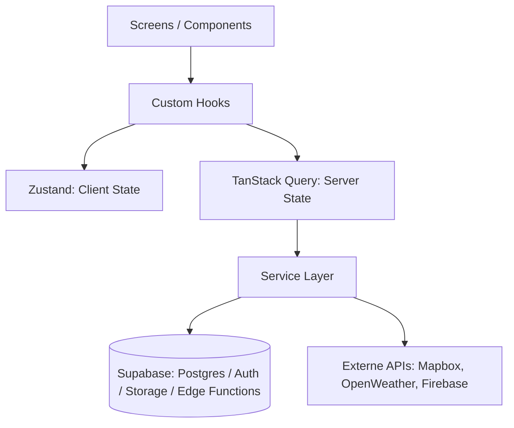
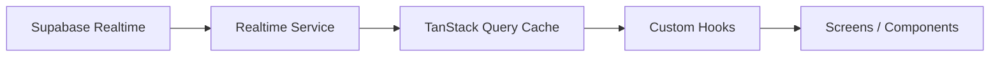
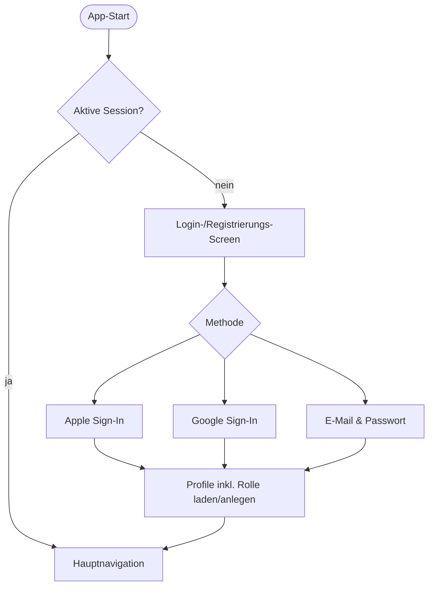
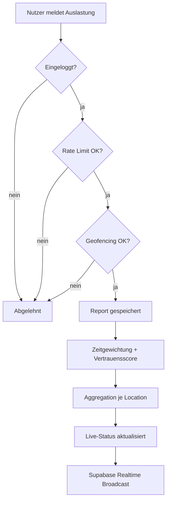
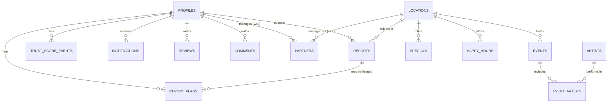

# Architecture — PlayaLive

> Status: Technische Architektur, aufbauend auf `docs/PRD.md`, `docs/Database.md`, `docs/API.md`,
> `docs/Design.md` und `CLAUDE.md`; nach einer vollständigen Qualitätsprüfung überarbeitet (Widersprüche,
> doppelte Diagramme und mehrdeutige Kapitel-Querverweise bereinigt). Dieses Dokument trifft **keine
> neuen Produktentscheidungen** — es strukturiert und operationalisiert ausschließlich bereits getroffene
> Entscheidungen für die technische Umsetzung. Es enthält noch keinen React-Native-Code.
>
> **Legende** (jeder Abschnitt/jede Zeile ist entsprechend markiert):
>
> - ✅ **Entschieden** — direkt aus `docs/PRD.md`, `docs/Database.md`, `docs/API.md`, `docs/Design.md`
>   oder `CLAUDE.md` übernommen, keine Interpretation nötig.
> - 🟡 **Abgeleiteter Vorschlag (zur Bestätigung)** — folgt zwingend aus bereits entschiedenen Prinzipien
>   (z. B. Service-Layer-Pflicht, Feature-Trennung), wurde aber in keinem Dokument wörtlich so festgelegt.
>   Gilt erst nach expliziter Bestätigung durch den Product Owner als verbindlich.
> - 🔴 **Offene Architekturentscheidung** — technisches Detail, zu dem keine Grundlage in den bestehenden
>   Dokumenten existiert. Muss vor der betroffenen Implementierung explizit geklärt werden.
>
> Eine gesammelte Liste aller 🔴-Punkte steht in Kapitel 25 „Zusammenfassung".

## 1. Projektphilosophie

Direkt aus `CLAUDE.md` und `PROJECT.md` übernommen (✅):

- **Erst verstehen, dann ändern.** Bestehenden Code/Struktur/Doku lesen, bevor etwas Neues hinzugefügt
  wird.
- **Dokumentation ist die Wahrheit.** `PROJECT.md`, `docs/` und `TASKS.md` sind die verbindliche
  Referenz für Scope, Datenmodell und Architektur — nicht Annahmen, nicht Trainingsdaten, nicht „wie
  andere Apps das machen".
- **Keine Annahmen ohne Rückfrage.** Fehlende Informationen werden erfragt bzw. explizit als 🔴 markiert
  — nie stillschweigend als Fakt behandelt.
- **MVP-first.** Kernfunktionen zuerst, keine Feature-Anhäufung vor einem lauffähigen MVP.
- **Einfachheit vor Abstraktion.** Keine vorzeitigen Abstraktionen oder Architektur für hypothetische
  Zukunftsfälle (Faustregel: Abstraktion erst ab der dritten Verwendung).
- **Saubere Architektur bleibt Priorität, auch unter Zeitdruck.** Kein „quick and dirty" für
  Live-Daten-Features (Auslastung, Community Reports) nur weil sie zeitkritisch wirken.
- **Iterativ.** Kleine, überprüfbare Schritte statt großer Big-Bang-Änderungen.
- **Nachvollziehbarkeit.** Entscheidungen werden dokumentiert (`docs/`), nicht nur im Code versteckt.

## 2. Architekturprinzipien

Direkt aus `CLAUDE.md` → Architekturregeln (✅):

1. Bestehende Architektur (dieses Dokument, `docs/Database.md`, `docs/API.md`) ist verbindlich.
   Abweichungen nur nach expliziter Absprache und Aktualisierung der Doku.
2. Klare Trennung: **UI-Komponenten / Screens / Navigation / Datenzugriff (Service Layer) /
   State-Management**. Keine Vermischung von Datenzugriff direkt in UI-Komponenten ohne
   Abstraktionsschicht.
3. **Business-Logik gehört nicht in Screens**, sondern in dedizierte Module/Hooks/Services.
4. **Keine neue Abhängigkeit** (Library/Package) ohne expliziten Auftrag oder Rücksprache.
5. **Keine parallelen Lösungen** für dasselbe Problem (z. B. zwei State-Management-Ansätze nebeneinander).
6. **Live-/Realtime-Datenflüsse** (Auslastung, Community Reports, Notifications) laufen über dieselbe
   Datenzugriffsschicht (Service Layer) wie alle anderen Daten — kein Sonderfall am Architekturmuster
   vorbei.
7. Das Frontend kommuniziert **niemals direkt mit Supabase** — ausschließlich über den Service Layer
   (siehe `docs/PRD.md` Kapitel 15).
8. Das Frontend entscheidet **niemals über Berechtigungen** — alle Sicherheitsregeln werden serverseitig
   (Supabase RLS) erzwungen (siehe Kapitel 17 „Sicherheit" in diesem Dokument).

## 3. Technologie-Stack

Direkt aus `docs/PRD.md` Kapitel 15 (✅):

| Bereich | Technologie |
|---|---|
| Frontend | React Native mit Expo (TypeScript) |
| Navigation | React Navigation |
| Backend/Datenbank | Supabase (Postgres, Auth, Realtime, Storage, Edge Functions) |
| Server State | TanStack Query |
| Client State | Zustand |
| Karten | Mapbox |
| Push Notifications | Firebase Notifications |
| Wetter | OpenWeather API (über eigenen `WeatherService`, austauschbar) |
| Sprache | TypeScript durchgängig (Frontend und Edge Functions) |
| DB-Migrationen | Supabase CLI, versioniert unter `supabase/migrations/` |

🟡 **Bereits angedeutet, Details offen:** `TASKS.md` → Expo Setup nennt ESLint und Prettier bereits als
vorgesehenes Lint-/Format-Tooling — das konkrete Regelwerk ist aber nicht festgelegt.

🔴 **Offene Architekturentscheidung:** konkrete Paketversionen, Expo-SDK-Version, Node-Version,
ESLint-/Prettier-Regelwerk, Testing-Framework (siehe Kapitel 19 „Testing"), Logging-/Monitoring-Anbieter
(siehe Kapitel 18 „Logging").

## 4. Projektstruktur

✅ Entschieden (aus `docs/PRD.md` Kapitel 15 „Migrationen"): Supabase-Migrationen liegen versioniert im
Repository unter `supabase/migrations/`.

✅ Bereits vorhanden (Repository-Wurzel): `docs/` (Produkt-/Architekturdokumentation), `PROJECT.md`,
`CLAUDE.md`, `TASKS.md`, `README.md`.

🔴 **Offene Architekturentscheidung:** wo der Expo-App-Code innerhalb des Repositories liegt — direkt im
Repository-Root (App-Code und `package.json` auf oberster Ebene neben `docs/`) oder in einem eigenen
Unterordner (z. B. `app/` oder `mobile/`). In `docs/PRD.md` Kapitel 22 bereits als offen vermerkt
(„Ordner-/Projektstruktur für das Expo-Projekt"). Die folgenden Kapitel (5–9) beschreiben deshalb die
Struktur **innerhalb** des App-Codes, unabhängig davon, wo dieser im Repository verortet wird.

## 5. Ordnerstruktur (innerhalb des App-Codes)

🟡 **Abgeleiteter Vorschlag, zur Bestätigung** — leitet sich zwingend aus den bereits entschiedenen
Prinzipien ab (Service Layer mit benannten Services, Feature-Trennung, Trennung
UI/Business-Logik/Datenzugriff/State, Naming Conventions aus `CLAUDE.md`), wurde aber in keinem
bestehenden Dokument wörtlich als Ordnerbaum festgelegt:

```
src/
├── app/                    # Navigation-Root, Einstiegspunkt, Auth-Gate (Login-Pflicht)
├── navigation/             # React-Navigation-Konfiguration (Tabs, Stacks)
├── features/                # Feature-basierte Module, siehe Kapitel 6
│   ├── auth/
│   ├── locations/
│   ├── events/
│   ├── artists/
│   ├── favorites/
│   ├── reports/             # Community Reports inkl. Trust Score, Geofencing
│   ├── specials/            # Specials & Happy Hours
│   ├── notifications/
│   └── weather/
├── components/               # Geteilte, wiederverwendbare UI-Bausteine (siehe Kapitel 22)
├── services/                # Service Layer — einzige Schnittstelle zu Supabase/externen APIs
├── hooks/                    # Geteilte, feature-übergreifende Custom Hooks
├── store/                    # Zustand-Stores (globaler Client-State)
├── lib/                      # Supabase-Client-Initialisierung, Konstanten, geteilte Utilities
├── types/                    # Geteilte TypeScript-Typen (Domänenbegriffe aus docs/Database.md)
└── theme/                    # Design-Tokens (sobald docs/DesignSystem.md vorliegt)
```

Diese Struktur gilt erst nach ausdrücklicher Bestätigung als verbindlich.

## 6. Feature-basierte Architektur

🟡 **Abgeleiteter Vorschlag**, basierend auf ✅ entschiedenen Prinzipien aus `CLAUDE.md`
(„Wiederverwendbarkeit vor Screen-spezifischer Einzellösung", Trennung Screens/Komponenten) und dem in
`docs/PRD.md` Kapitel 15 benannten Service Layer:

- Jede fachliche Domäne aus `docs/Database.md` (Locations, Events, Artists, Favorites, Reports,
  Specials/Happy Hours, Notifications, Weather, Auth) bildet ein eigenes Feature-Modul mit eigenen
  Screens, Feature-spezifischen Hooks und Feature-spezifischer Business-Logik.
- Wiederkehrende UI-Bausteine (Location-Card, Auslastungs-Badge, Artist-Card, Event-Card,
  Favoriten-Button — siehe `CLAUDE.md` → Komponenten-Regeln) werden **nicht** pro Feature dupliziert,
  sondern liegen als generische, parametrisierte Komponenten im geteilten `components/`-Ordner.
- Ein Feature-Modul darf ausschließlich über seinen eigenen Service (bzw. geteilte Services) auf Daten
  zugreifen — nie direkt auf ein anderes Feature-Modul oder auf Supabase.
- Screens **orchestrieren** (kombinieren Hooks, geteilte Komponenten, Navigation); sie enthalten selbst
  keine Business-Logik und keinen Datenzugriff (✅ `CLAUDE.md` → Komponenten-Regeln).

## 7. Navigation

✅ Entschieden (`docs/PRD.md` Kapitel 11):

- Grundstruktur: Tab-/Stack-Navigation mit den Bereichen **Home → Map → Events → Artists → Favorites →
  Profile**.
- Da Login ab v1.0 verpflichtend ist (kein Gastmodus), durchläuft jeder Nutzer vor der Hauptnavigation
  einen Login-/Registrierungs-Flow (Apple Sign-In / Google Sign-In / E-Mail & Passwort — siehe
  `docs/PRD.md` Kapitel 12). Es gibt keinen „App-Flow ohne Login".
- Der Community-Report-Flow ist kein eigener Tab, sondern Teil des Map-/Location-Kontexts
  (`docs/PRD.md` Kapitel 10).

🔴 **Offene Architekturentscheidung:** genaue Stack-Verschachtelung pro Tab (z. B. ob Location-Details
als Modal oder als Stack-Screen geöffnet werden), Deep-Linking-Konzept, Verhalten beim Session-Ablauf
während der Nutzung (automatischer Rücksprung zum Login vs. In-App-Hinweis).

## 8. Service Layer

✅ Entschieden (`docs/PRD.md` Kapitel 15): Das Frontend kommuniziert niemals direkt mit Supabase.
Namentlich benannte Services:

- `AuthService`
- `LocationService`
- `EventService`
- `ArtistService`
- `FavoriteService`
- `ReportService`
- `NotificationService`
- `WeatherService`

🟡 **Abgeleiteter Vorschlag:** da Specials, Happy Hours, Reviews und Comments als eigene Tabellen
existieren (`docs/Database.md` 2.7, 2.8, 2.12, 2.13) und laut Architekturprinzip 7 (Kapitel 2
„Architekturprinzipien") jeder Datenzugriff über den Service Layer läuft, benötigen auch sie eigene
Services (`SpecialService`, `HappyHourService`, `ReviewService`, `CommentService`) — diese wurden im PRD
nicht namentlich gelistet, folgen aber zwingend aus dem entschiedenen Muster. Die
Vertrauensscore-Berechnung (`docs/PRD.md` → Vertrauenssystem) läuft serverseitig (Edge Function) und wird
vom Frontend nicht direkt angesteuert — ein eigener `TrustScoreService` wäre allenfalls ein reiner
Lese-Zugriff auf `trust_score_events`.

Jeder Service ist verantwortlich für: Datenzugriff (direkt oder über eine Repository-Schicht — siehe
Kapitel 9 „Repository Pattern", dort noch offen), Mapping auf Domänentypen, Fehlerbehandlung im
einheitlichen Format (Kapitel 15 „Fehlerbehandlung"), Bereitstellung für TanStack-Query-Hooks bzw.
Zustand-Actions.

## 9. Repository Pattern

🔴 **Offene Architekturentscheidung.** In keinem bestehenden Dokument wurde festgelegt, ob unterhalb des
Service Layer zusätzlich eine dedizierte Repository-Schicht (reine Datenzugriffs-/Query-Funktionen ohne
Business-Logik) existiert, oder ob Services den Supabase-Client direkt kapseln. Zwei Optionen, beide
vereinbar mit den entschiedenen Prinzipien aus Kapitel 2 „Architekturprinzipien":

- **Option A — Service kapselt Zugriff direkt:** `LocationService` enthält sowohl die
  Supabase-Query-Logik als auch etwaige Business-Regeln. Weniger Schichten, schneller für den
  MVP-Umfang.
- **Option B — Repository unterhalb des Service:** ein `LocationRepository` kapselt ausschließlich rohe
  Supabase-Queries (CRUD); der `LocationService` orchestriert Business-Logik darüber (z. B.
  Report-Aggregation, Trust-Score-Gewichtung). Bessere Testbarkeit einzelner Schichten, mehr
  Boilerplate.

Diese Entscheidung sollte vor Beginn der Implementierung des Service Layer getroffen werden.

## 10. State Management (TanStack Query + Zustand)

✅ Entschieden (`docs/PRD.md` Kapitel 15, vollständig):

| Schicht | Zuständigkeit | Beispiele |
|---|---|---|
| **TanStack Query** (Server State) | Ausschließlich vom Backend geladene Daten: Datenabruf, Caching, Background Refresh, Optimistic Updates, Fehlerbehandlung, Sync mit Supabase | Locations, Events, Künstler, Wetter, Favoriten, Specials, Details |
| **Zustand** (globaler Client State) | Ausschließlich globaler Client-/UI-State, keine dauerhaften Backend-Daten | Login-Status, aktive Filter, Suchbegriffe, Kartenstatus, Theme, Sprache, Einstellungen, Bottom-Navigation-Zustand |
| **React State** (lokal) | Lokaler Komponentenstatus, ausschließlich React Hooks | Modals, Inputs, Animationen, Ladezustände, Formulare |
| **Supabase Realtime** | Aktualisiert automatisch den TanStack-Query-Cache | siehe Kapitel 11 „Realtime-Architektur" |

Architekturregel: kein direkter Datenbankzugriff aus Screens/Komponenten; wiederverwendbare Custom
Hooks kapseln die Kommunikation zwischen UI und Services; Komponenten enthalten ausschließlich
Präsentationslogik.

🔴 **Offene Architekturentscheidung:** Struktur/Aufteilung der Zustand-Stores (ein globaler Store vs.
mehrere themenbezogene Stores), Query-Key-Konventionen für TanStack Query, Cache-Invalidierungsstrategie
im Detail je Entität. Zusätzlich führt `docs/PRD.md` Kapitel 15 „Sprache" explizit als Teil des
Zustand-Client-State auf, ohne dass irgendwo eine Mehrsprachigkeits-/i18n-Strategie (unterstützte
Sprachen, i18n-Bibliothek, Übersetzungsverwaltung) entschieden wäre — ebenfalls offen.

## 11. Realtime-Architektur

✅ Entschieden (`docs/PRD.md` Kapitel 15 „Realtime-Kanäle"):

- Realtime wird **gezielt** eingesetzt, nicht pauschal für alle Tabellen.
- **Aktiviert:** Reports (Live-Auslastung, Wartezeit, Stimmung, Trend, Vertrauensindikator),
  Notifications, Events (kurzfristige Änderungen), Specials & Happy Hours, sowie ausschließlich die
  Live-Daten-Felder von Locations (nicht deren Stammdaten).
- **Nicht permanent per Realtime synchronisiert:** Künstlerprofile, Benutzerprofile, Einstellungen,
  Favoriten, Bewertungen, Kommentare, Medien, historische Daten (laufen über TanStack Query).
- Realtime-Abonnements laufen ausschließlich über einen zentralen **Realtime Service** — Screens/
  Komponenten kommunizieren niemals direkt mit Supabase Realtime.
- Performance-Regeln: nur sichtbare Screens abonnieren; nicht sichtbare Screens beenden Subscriptions
  automatisch; Events werden intelligent gebündelt (Debouncing).

Diagramm des Datenflusses: siehe Kapitel 23.2 „Realtime-Datenfluss".

🔴 **Offene Architekturentscheidung:** konkrete Reconnect-/Backoff-Strategie bei Verbindungsabbruch,
genaues Debouncing-Zeitfenster für gebündelte Events.

## 12. Authentifizierung

✅ Entschieden (`docs/PRD.md` Kapitel 12):

- Login ist ab v1.0 **verpflichtend** — kein Gastmodus.
- Unterstützte Methoden: Apple Sign-In (iOS), Google Sign-In, E-Mail & Passwort.
- Nach erfolgreicher Anmeldung erhält der Nutzer automatisch Zugriff entsprechend seiner serverseitig
  zugewiesenen Rolle (siehe Kapitel 13 „Rollenmodell").
- Umsetzung über Supabase Auth, gekapselt im `AuthService` (siehe Kapitel 8 „Service Layer").

Diagramm des Login-Flows: siehe Kapitel 23.3 „Auth-Flow".

🔴 **Offene Architekturentscheidung:** Verhalten bei abgelaufener Session während aktiver Nutzung
(stiller Refresh vs. erzwungener Re-Login), Passwort-Reset-Flow im Detail, Umgang mit
E-Mail-Verifizierung.

## 13. Rollenmodell

✅ Entschieden (`docs/PRD.md` Kapitel 12, `docs/Database.md` 2.1):

| Rolle | Verfügbar ab | Kernberechtigungen |
|---|---|---|
| `user` | v1.0 | Öffentliche Locations/Events/Artists/Wetter lesen; eigene Favoriten, Reports, Reviews, Comments verwalten; eigenes Profil lesen/bearbeiten |
| `location_manager` | v2.0 | Zusätzlich: ausschließlich die eigene verifizierte Location, deren Events, Specials, Happy Hours, Bilder verwalten |
| `admin` | v1.0 | Sämtliche Locations, Künstler, Events verwalten; Community moderieren; Partner verwalten |
| `super_admin` | v1.0 | Vollständiger Systemzugriff inkl. Benutzer-/Rollenverwaltung, Systemeinstellungen, Sicherheitsverwaltung, Monetarisierung, Partnerfreigaben |

Die Rolle wird im Feld `role` der Tabelle `profiles` gespeichert und ist alleinige, serverseitig über
RLS durchgesetzte Berechtigungsgrundlage (siehe Kapitel 17 „Sicherheit"). Das Frontend nutzt die Rolle
ausschließlich, um UI bedingt anzuzeigen — nie, um Berechtigungen selbst durchzusetzen.

## 14. Datenfluss

✅ Entschieden, zusammengeführt aus `docs/PRD.md` Kapitel 15:

Daten fließen ausschließlich in eine Richtung durch die Schichten: **Screens/Components → Custom Hooks →
Zustand (Client State) / TanStack Query (Server State) → Service Layer → Supabase bzw. externe APIs**,
ergänzt um Supabase Realtime, das über den Realtime Service direkt in den TanStack-Query-Cache schreibt
(siehe Kapitel 11 „Realtime-Architektur"). Ein Screen greift nie direkt auf den Service Layer oder auf
Supabase zu, sondern immer über einen Custom Hook.

Diagramme: siehe Kapitel 23.1 „Schichtenarchitektur" (Basis-Datenfluss) und Kapitel 23.2
„Realtime-Datenfluss" (Realtime-Pfad im Detail).

## 15. Fehlerbehandlung

✅ Entschieden (`docs/PRD.md` Kapitel 15 „Fehlerbehandlung"):

- Zentrale Fehlerbehandlung ausschließlich im Service Layer; einheitliches Fehlerformat.
- Screens/Komponenten enthalten keine eigene API-Fehlerlogik.
- Technische Fehlermeldungen werden dem Nutzer nie direkt angezeigt — stattdessen verständliche Texte.
- Automatische Retries nur bei temporären Netzwerkfehlern; dauerhafte Fehler (fehlende Berechtigung,
  ungültige Daten) werden nicht automatisch wiederholt.
- Jeder Screen kennt vier Zustände: **Loading, Success, Empty, Error**.
- Fehler werden zentral protokolliert, ohne personenbezogene Daten zu loggen (siehe Kapitel 18
  „Logging").

🔴 **Offene Architekturentscheidung:** exaktes Fehlerobjekt-Format (Felder, Fehlercode-Katalog),
konkrete Retry-Parameter (Anzahl Versuche, Backoff-Strategie).

## 16. Performance

✅ Entschieden (`PROJECT.md` → Design-Richtlinien, `docs/PRD.md` Kapitel 15/17/20):

- Karte und Live-Daten müssen auch bei schlechter mobiler Verbindung nutzbar bleiben.
- Realtime-Performance-Regeln (gezielter Einsatz statt pauschal, automatisches Beenden nicht sichtbarer
  Subscriptions, Debouncing): siehe Kapitel 11 „Realtime-Architektur".
- TanStack-Query-Caching reduziert redundante Anfragen; gezielte Cache-Invalidierung statt permanentem
  Neuladen.
- Bild-Performance über Storage-Buckets: automatische Komprimierung, moderne Formate (WebP/AVIF),
  mehrere Bildgrößen (Thumbnail/Medium/Original) — siehe `docs/PRD.md` Kapitel 15 „Storage-Buckets".
- Hohe Last in der Hauptsaison ist als Risiko dokumentiert (`docs/PRD.md` Kapitel 20); Gegenmaßnahmen:
  Caching, gezielte Realtime-Nutzung, optimierte DB-Abfragen, Performance-Monitoring.
- Kartenmarker-Clustering ist als Vorhaben bereits in `TASKS.md` → Mapbox Integration vermerkt
  („Location-Marker und Clustering auf der Karte") — die konkrete Clustering-Strategie ist offen (siehe
  unten).

🔴 **Offene Architekturentscheidung:** konkrete Performance-Budgets (z. B. Zeit bis interaktiv,
Ziel-Framerate der Kartenanimation), Monitoring-Tooling (siehe Kapitel 18 „Logging"), konkrete
Clustering-Strategie/-Algorithmus für die Kartenmarker.

## 17. Sicherheit

✅ Entschieden, zusammengeführt aus `docs/PRD.md` Kapitel 12 und 15:

- **Login-Pflicht**, kein Gastmodus.
- **Row-Level-Security „Security by Default"**: alle Tabellen mit aktivierter RLS, „Deny by Default",
  jede Berechtigung explizit über Policies. Das Frontend entscheidet nie über Berechtigungen.
- Jede Tabelle besitzt einen Owner/eine eindeutige Berechtigung; jeder Datensatz ist einem Ersteller
  zugeordnet; Änderungen werden mit Zeitstempel gespeichert; kritische Änderungen werden protokolliert
  (Audit Log); Soft Delete statt endgültigem Löschen, sofern sinnvoll; Fremdschlüssel sichern alle
  Beziehungen.
- API-Endpunkte prüfen zusätzlich: Authentifizierung, Rolle, Berechtigung, Besitz des Datensatzes,
  Eingabedaten, Rate Limiting.
- **Missbrauchsschutz bei Community Reports:** Login-Pflicht, Rate Limiting (max. ein Report pro Nutzer/
  Location je Zeitfenster), Geofencing (100–150 m Radius), Vertrauensscore-Gewichtung,
  Mehrfachbestätigung, Meldefunktion, automatische Missbrauchserkennung — alle Prüfungen serverseitig.
- Storage: kein Upload ohne Authentifizierung; Schreibrechte je Bucket rollenbasiert (siehe
  `docs/PRD.md` Kapitel 15 „Storage-Buckets").
- **Datenschutz (DSGVO):** `docs/PRD.md` Kapitel 20 „Risiken" nennt die Verarbeitung von Standort- und
  personenbezogenen Daten (Geofencing, Trust Score) explizit als Risiko und fordert DSGVO-konforme
  Verarbeitung, transparente Datenschutzerklärung, Einwilligung für Standortzugriff und Speicherung nur
  notwendiger Daten. Die konkrete technische Umsetzung ist noch offen (siehe unten).

🔴 **Offene Architekturentscheidung:** konkrete Verwaltung von Umgebungsvariablen/Secrets (.env-Strategie,
Trennung Dev/Staging/Prod, Handling von Supabase-/Mapbox-/Firebase-/OpenWeather-Keys — in `docs/PRD.md`
Kapitel 22 bereits als offen vermerkt), Zertifikats-/Transport-Sicherheit über die Supabase-Standards
hinaus, Verantwortlichkeit für periodische Sicherheitsüberprüfungen, konkreter Consent-Flow für den
Standortzugriff (Geofencing) sowie technische Umsetzung von DSGVO-Betroffenenrechten (Datenauskunft,
Löschung).

## 18. Logging

✅ Entschieden (`docs/PRD.md` Kapitel 15 „Fehlerbehandlung"): Fehler werden zentral protokolliert, ohne
personenbezogene Daten zu loggen.

🔴 **Offene Architekturentscheidung:** konkretes Logging-/Monitoring-Tooling (z. B. Sentry oder
vergleichbar), Log-Level-Konzept, Aufbewahrungsfristen, Umgang mit Logging in Supabase Edge Functions.

## 19. Testing

🔴 **Offene Architekturentscheidung**, aber mit teilweiser Vorprägung durch `TASKS.md` → Testing: dort
sind bereits die groben Testarten benannt — „Unit-Tests für Kernlogik", „Manuelle Testdurchläufe für
Kern-Flows" (Map, Events, Favorites, Community Report, Auth) und „Fehler-/Edge-Case-Tests" —, sowie der
Umfang „Unit/Integration/E2E" als Klammer für die noch zu definierende Teststrategie. Welches konkrete
Framework, welche Testpyramide und welches Abdeckungsziel dahinterstehen, ist jedoch nicht festgelegt.

Aus den bereits entschiedenen Architekturprinzipien (strikte Trennung UI/Business-Logik/Datenzugriff,
Kapitel 2 „Architekturprinzipien" und Kapitel 10 „State Management") folgt zusätzlich **implizit**, dass
Business-Logik in Hooks/Services unabhängig von der UI testbar sein muss — das ist eine Eigenschaft der
Architektur, keine Festlegung eines Testing-Frameworks.

Zu klären vor Beginn der Implementierung: Unit-Test-Framework, Component-/Integration-Test-Ansatz für
React Native, E2E-Test-Strategie, Testumfang für Supabase-Datenzugriff (Mocking vs. Test-Datenbank),
konkretes Testabdeckungsziel.

## 20. Coding Standards

✅ Entschieden, direkt aus `CLAUDE.md` → Code-Qualität:

- TypeScript strikt nutzen, keine `any`-Typen ohne triftigen Grund und Kommentar.
- Keine toten Codepfade, keine auskommentierten Codeblöcke committen.
- Keine Fehlerbehandlung/Validierung für Fälle, die nicht eintreten können — nur an echten
  Systemgrenzen validieren (User-Input, externe APIs, Supabase-Antworten).
- Keine vorzeitigen Abstraktionen oder Hilfsfunktionen „für später" — erst ab echter Wiederverwendung
  (Faustregel: ab 3. Verwendung).
- Lesbarkeit vor Cleverness. Klarer, einfacher Code statt kompakter Tricks.
- Kommentare nur, wenn das *Warum* nicht aus dem Code hervorgeht — kein Kommentar, der nur wiederholt,
  was der Code offensichtlich tut.

## 21. Naming Conventions

✅ Entschieden, direkt aus `CLAUDE.md` → Namenskonventionen:

| Element | Konvention | Beispiel |
|---|---|---|
| Ordner | kebab-case | `location-details/` |
| Komponenten-Dateien | PascalCase | `LocationCard.tsx` |
| Hooks-/Utils-Dateien | camelCase | `useLocationStatus.ts` |
| Komponenten | PascalCase | `LiveMap`, `FavoriteButton` |
| Hooks | Präfix `use` | `useAuth`, `useEventList` |
| Variablen/Funktionen | camelCase, sprechende Namen | — |
| Echte Konstanten | UPPER_SNAKE_CASE | — |
| Typen/Interfaces | PascalCase, kein `I`-Präfix | `Location`, nicht `ILocation` |
| Fachbegriffe | konsistent aus `docs/Database.md`/`docs/API.md` | `Location`, `Artist`, `Event`, `Report` |
| Sprache | Code/Variablen/Funktionen: Englisch; fachliche Doku (`docs/`, `PROJECT.md`): Deutsch | — |

## 22. Komponentenregeln

✅ Entschieden, direkt aus `CLAUDE.md` → Komponenten-Regeln:

- Eine Komponente = eine klar abgegrenzte Verantwortung. Keine „God-Components".
- Screens orchestrieren, wiederverwendbare UI-Bausteine liegen im gemeinsamen `components/`-Ordner
  (siehe Kapitel 5 „Ordnerstruktur").
- **Wiederverwendbarkeit vor Screen-spezifischer Einzellösung:** wiederkehrende UI-Bausteine
  (Location-Card, Auslastungs-Badge, Artist-Card, Event-Card, Favoriten-Button) werden als generische,
  parametrisierte Komponenten gebaut, nicht pro Screen dupliziert.
- Props explizit typisieren, keine impliziten `any`-Props.
- Keine Geschäftslogik/Datenzugriff direkt in rein visuellen Komponenten — über Hooks/Props einreichen.
- Styling einheitlich nach der in `docs/Design.md` festgelegten Methode (Dark Mode als Basis,
  Neon-Akzente) — keine Screen-eigenen Ad-hoc-Styles, die vom Designsystem abweichen. Konkrete
  Styling-Tokens folgen mit `docs/DesignSystem.md` (siehe `docs/PRD.md` Kapitel 21).
- Barrierefreiheit (Kontraste, Lesbarkeit, Screenreader-Unterstützung) ist bereits als Prinzip in
  `docs/Design.md` Kapitel 9 verankert und gilt für jede einzelne Komponente — konkrete
  Umsetzungsdetails (z. B. Accessibility-Labels je Komponententyp) folgen mit `docs/DesignSystem.md`.

## 23. Architekturdiagramme (Mermaid)

### 23.1 Schichtenarchitektur (siehe auch Kapitel 10 „State Management" und Kapitel 14 „Datenfluss")



### 23.2 Realtime-Datenfluss (siehe auch Kapitel 11 „Realtime-Architektur")



### 23.3 Auth-Flow (siehe auch Kapitel 12 „Authentifizierung")



### 23.4 Community-Report-Pipeline (siehe `docs/PRD.md` Kapitel 15)



### 23.5 Entity-Relationship-Übersicht (siehe `docs/Database.md`)



> Hinweis: `FAVORITES` ist bewusst nicht in diesem Diagramm enthalten, da die Tabelle polymorph auf
> `LOCATIONS`, `ARTISTS` oder `EVENTS` verweist (`target_type` + `target_id`, kein klassischer
> Fremdschlüssel) — siehe `docs/Database.md` 2.9.

## 24. Best Practices

✅ Zusammengeführt aus `CLAUDE.md` und den bereits entschiedenen Architekturkapiteln:

- Vor jeder Änderung: relevante Datei(en) und zugehörige Doku (`docs/`) lesen.
- Kleinstmöglichen Änderungsumfang wählen, der die Aufgabe löst.
- Bestehende Muster im Projekt wiederverwenden statt neue Muster einzuführen.
- Nach jeder Änderung prüfen, ob Doku (`docs/`, `TASKS.md`) aktualisiert werden muss.
- Keine Refactorings „nebenbei" außerhalb des Auftragsumfangs — das wird separat vorgeschlagen, nicht
  automatisch mitgemacht.
- Keine neuen Dateien/Ordner ohne klaren Zweck; keine Platzhalter-, Backup- oder „just in case"-Dateien.
- Bei Widerspruch zwischen Code und Doku: aktiv ansprechen, nicht stillschweigend eine Seite bevorzugen.

## 25. Zusammenfassung

PlayaLive verwendet eine strikt geschichtete Architektur: **Screens → Custom Hooks → State
(TanStack Query / Zustand / React State) → Service Layer → Supabase / externe APIs**, ergänzt um einen
zentralen Realtime Service für zeitkritische Live-Daten (Community Reports, Notifications, Events,
Specials & Happy Hours). Zugriffsrechte werden ausschließlich serverseitig über Supabase Row-Level-
Security anhand des Rollenmodells (`user` / `location_manager` / `admin` / `super_admin`) durchgesetzt.
Login ist verpflichtend, es gibt keinen Gastzugriff. Die Ordner- und Feature-Struktur (Kapitel 5–6) folgt
konsequent aus den bereits im PRD festgelegten Prinzipien, ist aber als Vorschlag zu verstehen, bis sie
bestätigt ist.

### Gesammelte offene Architekturentscheidungen (🔴)

| # | Thema | Kapitel |
|---|---|---|
| 1 | Konkrete Paketversionen, Expo-SDK, Node-Version, ESLint-/Prettier-Regelwerk (Tools selbst bereits in `TASKS.md` vorgesehen) | 3 |
| 2 | Logging-/Monitoring-Anbieter | 3, 18 |
| 3 | Verortung des App-Codes im Repository (Root vs. Unterordner) | 4 |
| 4 | Genaue Navigations-Stack-Verschachtelung, Deep-Linking, Session-Ablauf-Verhalten | 7 |
| 5 | Repository-Pattern: eigene Schicht unterhalb der Services oder nicht | 9 |
| 6 | Struktur/Aufteilung der Zustand-Stores, Query-Key-Konventionen, Cache-Invalidierung im Detail, Mehrsprachigkeits-/i18n-Strategie | 10 |
| 7 | Realtime-Reconnect-/Backoff-Strategie, Debouncing-Zeitfenster | 11 |
| 8 | Session-Refresh-Verhalten, Passwort-Reset-Flow, E-Mail-Verifizierung | 12 |
| 9 | Fehlerobjekt-Format, Fehlercode-Katalog, Retry-Parameter | 15 |
| 10 | Performance-Budgets, Monitoring-Tooling, konkrete Kartenclustering-Strategie (Clustering an sich bereits in `TASKS.md` vorgesehen) | 16 |
| 11 | .env-/Secrets-Strategie, Umgebungstrennung, Security-Review-Verantwortlichkeit, Consent-Flow für Standortzugriff, DSGVO-Betroffenenrechte | 17 |
| 12 | Teststrategie im Detail (Framework, Testpyramide, Coverage-Ziel — grobe Testarten bereits in `TASKS.md` vorgesehen) | 19 |

Diese Punkte sollten — analog zum bisherigen Vorgehen beim PRD — vor der jeweils betroffenen
Implementierung einzeln mit dem Product Owner geklärt werden, z. B. im Rahmen der geplanten
ADR-Dokumente (`docs/ADR/001-State-Management.md` bis `008-Security.md`, siehe `docs/PRD.md` Kapitel
21).
